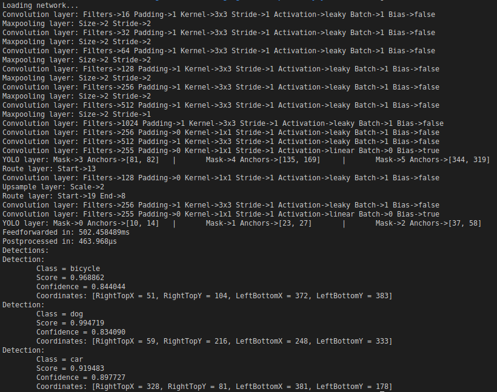

# Tiny YOLO v3

## Table of Contents

- [About](#about)
- [Theory](#theory)
- [Run example](#run-example)
- [Benchmark](#benchmark)

This is an example of Tiny YOLO v3 neural network.

**Note: do not try to use common yolov3, because shortcut layer is not implemented here**

Folder `model` contains yolov3-tiny.cfg on which file `yolov3_tiny.go` based.

Folder `data` contains image file `dog_416x416.jpg` - this is scaled to 416x416 image for make it better understanding of how net works.

## Theory
You can read about this network [here](https://pjreddie.com/darknet/yolo/).

Architecture of network:
```
0 Convolutional 16 3 × 3/1 416 × 416 × 3 416 × 416 × 16
1 Maxpool    2 × 2/2 416 × 416 × 16 208 × 208 × 16
2 Convolutional 32 3 × 3/1 208 × 208 × 16 208 × 208 × 32
3 Maxpool    2 × 2/2 208 × 208 × 32 104 × 104 × 32
4 Convolutional 64 3 × 3/1 104 × 104 × 32 104 × 104 × 64
5 Maxpool    2 × 2/2 104 × 104 × 64 52 × 52 × 64
6 Convolutional 128 3 × 3/1 52 × 52 × 64 52 × 52 × 128
7 Maxpool    2 × 2/2 52 × 52 × 128 26 × 26 × 128
8 Convolutional 256 3 × 3/1 26 × 26 × 128 26 × 26 × 256
9 Maxpool    2 × 2/2 26 × 26 × 256 13 × 13 × 256
10 Convolutional 512 3 × 3/1 13 × 13 × 256 13 × 13 × 512
11 Maxpool    2 × 2/1 13 × 13 × 512 13 × 13 × 512
12 Convolutional 1024 3 × 3/1 13 × 13 × 512 13 × 13 × 1024
13 Convolutional 256 1 × 1/1 13 × 13 × 1024 13 × 13 × 256
14 Convolutional 512 3 × 3/1 13 × 13 × 256 13 × 13 × 512
15 Convolutional 255 1 × 1/1 13 × 13 × 512 13 × 13 × 255
16 YOLO        
17 Route 13       
18 Convolutional 128 1 × 1/1 13 × 13 × 256 13 × 13 × 128
19 Up‐sampling    2 × 2/1 13 × 13 × 128 26 × 26 × 128
20 Route 19 8       
21 Convolutional 256 3 × 3/1 13 × 13 × 384 13 × 13 × 256
22 Convolutional 255 1 × 1/1 13 × 13 × 256 13 × 13 × 256
23 YOLO 
```

You can see source code for each layer's implementation in corresponding files:

Convolution - https://github.com/gorgonia/gorgonia/blob/master/nn.go#L237

Maxpool - https://github.com/gorgonia/gorgonia/blob/master/nn.go#L332

Up-sampling - https://github.com/gorgonia/gorgonia/blob/master/op_upsample.go

Route - [route](route_layer.go)

YOLO - [op_yolo](../../op_yolo.go)

## Run example
How to run:
```go
go run .
```

What you can expect to see:



## Benchmark
Benchmark for network's feedforward function provided [here](main_benchmark_test.go)